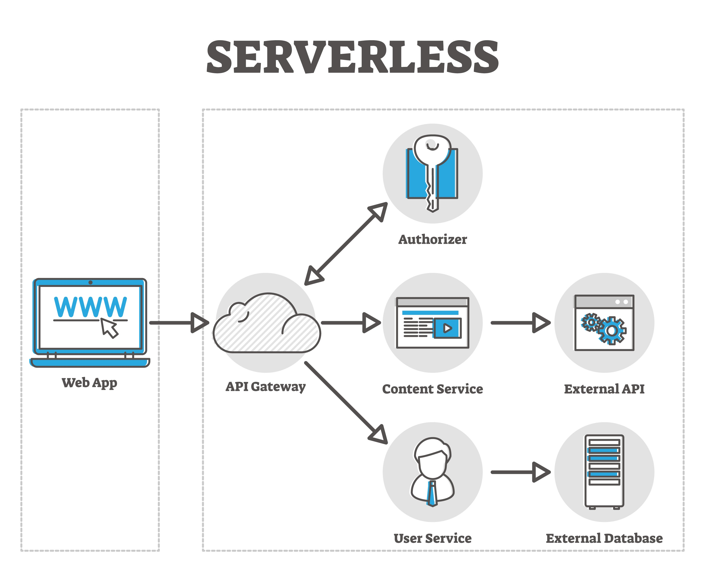

# 🧠 AI Pulse: Intelligent News Aggregator & Dashboard
### 🌐 **Live Demo**
https://ai-news-frontend-d1ld.onrender.com

### 🔗 **Preview**

<p align="center">
  
</p>


---

## 📋 Overview

**AI Pulse** is a production-ready, full-stack intelligence engine that aggregates, clusters, and ranks high-impact AI news.
Unlike simple RSS readers, it uses an internal **Intelligence Layer** to group similar stories into **Topic Clusters** and rank them using a weighted popularity score.

It automatically ingests news from **20+ high-signal sources** (OpenAI, Google Research, TechCrunch, Wired, etc.) and presents them in a premium interactive dashboard.

---

## ✨ Key Features (V2 Upgrade)

* **🔥 Topic Clustering:** Groups related articles into unified Topic Cards
* **📈 Popularity Scoring:** Weighted score based on Coverage, Diversity & Velocity
* **🤖 Automated Ingestion:** Self-healing RSS fetcher
* **📊 Intelligence Dashboard:**

  * All News
  * Popular
  * Favorites
* **📢 Social Broadcasting:** Share topics to LinkedIn + WhatsApp (simulated)
* **🚀 Zero-Config Deployment:** Entire system boots with 1 command (Docker)

---

# 🏗️ System Architecture

**Data Flow:**
`Sources` ➡️ `Fetcher` ➡️ `Clustering Engine` ➡️ `PostgreSQL` ➡️ `FastAPI` ➡️ `Next.js Dashboard`
### Architecture Overview


| Architecture                       |
| ---------------------------------- |
|  |

---

## 🧩 Component Breakdown

| Component               | Tech Stack                       | Role                                  |
| ----------------------- | -------------------------------- | ------------------------------------- |
| **Frontend**            | Next.js 14, Tailwind CSS, Lucide | Interactive dashboard UI              |
| **Backend**             | FastAPI, SQLAlchemy              | REST API for news, topics & favorites |
| **Intelligence Engine** | Python                           | Clustering + scoring                  |
| **Ingestion Layer**     | Feedparser, Requests             | RSS normalization & ingestion         |
| **Database**            | PostgreSQL 15                    | Topics, news_items, favorites         |
| **DevOps**              | Docker + Docker Compose          | Container orchestration               |

---

# 🧠 Intelligence Engine (V2 — The Brain)

### 1. Topic Clustering

Detects keyword overlap to group duplicate stories from different sources.

### 2. Popularity Scoring Formula

```
Score = (0.4 × Coverage) + (0.2 × Diversity) + (0.2 × Velocity)
```

---

# 🚀 How to Run (1-Step Setup)

### **Prerequisite:**

Install **Docker Desktop**.

### **Start the system:**

```bash
docker-compose up --build
```

### **Access the application:**

* Dashboard → [http://localhost:3000](http://localhost:3000)
* API Docs → [http://localhost:8000/docs](http://localhost:8000/docs)

### **Cold Start Info:**

First run will automatically:
✔ Seed 20+ sources
✔ Ingest fresh articles
✔ Run clustering + scoring

⏱ Takes ~15–20 seconds on first boot.

---

# 📂 Project Structure

```
ai-news-dashboard
├── backend
│   ├── main.py
│   ├── clustering.py
│   ├── fetcher.py
│   ├── crud.py
│   ├── models.py
│   └── seed.py
│
├── frontend
│   ├── app/page.tsx
│   └── ...
│
├── docker-compose.yml
└── README.md
```

---

# 🔮 Future Improvements & Trade-offs

* **Clustering:** The MVP uses lightweight keyword-based clustering so it can run fully offline without relying on paid OpenAI API endpoints. A production deployment would upgrade this to **pgvector-powered semantic embeddings** for far more accurate topic grouping.

* **Social Score:** The current scoring model excludes **Social Engagement Signals** (e.g., Reddit upvotes, X/Twitter mentions) to avoid requiring advanced API credentials during review. Future versions will integrate multi-platform social metrics for a richer popularity index.

* **Generative AI:** Upcoming versions will leverage **LLMs to auto-generate polished LinkedIn captions and summaries**, replacing the current basic RSS-based summaries for a more personalized publishing experience.


---
